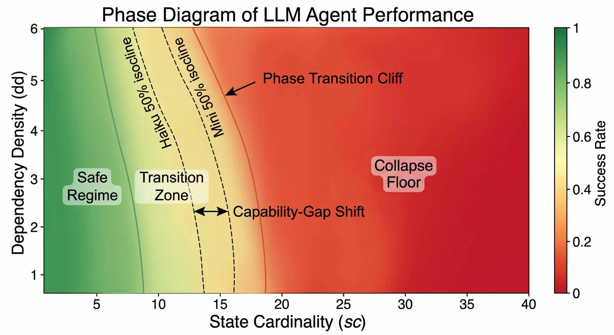

<h1 align="center">World-Model Collapse</h1>

<p align="center">
  <strong>World-Model Collapse as a Phase Transition</strong><br>
  Xinyuan Song, Zekun Cai
</p>

<p align="center">
  <a href="https://arxiv.org/abs/2606.31399"></a>
  <a href="https://arxiv.org/pdf/2606.31399"></a>
  <a href="https://doi.org/10.48550/arXiv.2606.31399"></a>
  
  <a href="LICENSE"></a>
</p>

<p align="center">
  A deterministic evaluation suite for studying when long-horizon language agents preserve an internal world model, and when that world model abruptly collapses.
</p>



The figure shows the core intuition behind the experiments: as task stress increases, agent success can move from a stable regime into a narrow transition zone and then fall onto a collapse floor. The scans in this repository test where that boundary appears under different state sizes, dependency densities, horizons, and model settings.

## Overview

This repository provides the code used to study **world-model collapse** in language-model agents. The central question is whether increasing task stress produces gradual degradation or a sharp phase-transition-like boundary. The experiments vary state cardinality, dependency density, horizon length, branching factor, observation noise, and mutation rate, then measure both final task success and per-step internal-state fidelity.

The codebase is designed around a controlled agent loop:

1. The environment emits an observation and an exact gold state.
2. The agent updates its internal world model.
3. The agent proposes an action.
4. The agent self-checks whether the action should be valid.
5. The environment executes the action and logs per-step diagnostics.

This makes it possible to distinguish **world-model failure** from ordinary action-selection failure. In the logged traces, collapse can be studied through world-state accuracy, action validity, self-check accuracy, false progress, state staleness, token usage, and episode-level success.

## Highlights

- Deterministic planning environments with explicit gold states.
- LLM-backed and oracle-style agents under a shared interface.
- Three-call agent loop: updater, planner, and self-diagnosis.
- Canonical JSONL logging for per-step and per-episode analysis.
- Cost tracking and bounded-wave dispatch for large experiment sweeps.
- Scripts for phase-boundary scans, ablations, cross-model checks, and statistical analyses.

## Codebase

```text
src/
  environments/          Deterministic task families and shared environment API
  agents/                Oracle agents, LLM agents, prompts, JSON parsing, API clients
  evaluation/            Episode runner, world-state metrics, JSONL logging
  runner/                Batch execution, cell specs, cost tracking

experiments/
  stage5_smoke/          Small end-to-end OpenAI smoke test
  stage5_a/, stage5_b/   gpt-4o-mini grid experiments
  stage5b_ablations/    Horizon, branching, observation-noise, mutation-rate ablations
  critical_scans/        Fine-grained scans around critical boundaries
  cross_harness/         Memory-mode and cross-model harness checks

analysis/
  Acceptance tests, effect sizes, bootstrap intervals, lag analyses,
  multiple-testing correction, and cluster bootstrap utilities
```

Available environments are registered in `src.environments.ENV_REGISTRY`:

- `graph_nav`
- `tool_dag`
- `stateful_puzzle`

## Installation

```bash
git clone git@github.com:Hik289/world-model-collapse.git
cd world-model-collapse

python -m venv .venv
source .venv/bin/activate
pip install -r requirements.txt
pip install -e .
```

## Model Configuration

Most scripts are configured for OpenAI-compatible runs. Set an API key before running the smoke test or experiment scripts:

```bash
export OPENAI_API_KEY="your-openai-api-key"
```

For Anthropic-compatible or other provider experiments, configure your local client/proxy setup and model IDs according to your own infrastructure. The relevant integration point is `src/agents/llm_client.py`.

Do not commit API keys, proxy credentials, generated logs, or cost trackers.

## Quick Start

Run the end-to-end smoke test:

```bash
python experiments/stage5_smoke/run_stage5_smoke.py
```

The smoke test runs a small `gpt-4o-mini` slice on `stateful_puzzle`, writes step and episode logs under `data/raw_logs/`, and writes a summary to:

```text
experiments/stage5_smoke/stage5_smoke_results.json
```

Generated artifacts under `data/`, `outputs/`, `results/`, `logs/`, `*.jsonl`, and cost-tracker files are ignored by Git.

## Experiments

Critical-boundary scans:

```bash
python experiments/critical_scans/run_exp_sc_fine.py
python experiments/critical_scans/run_exp_t_fine.py
```

Stage 5B ablations:

```bash
python experiments/stage5b_ablations/run_stage5b_ablation_T.py
python experiments/stage5b_ablations/run_stage5b_ablation_branching.py
python experiments/stage5b_ablations/run_stage5b_ablation_obs_noise.py
python experiments/stage5b_ablations/run_stage5b_ablation_mut_rate.py
```

Cross-harness and cross-model checks:

```bash
python experiments/cross_harness/run_exp_b_mode_a.py
python experiments/cross_harness/run_exp_C1_llama3.py
python experiments/cross_harness/run_exp_C2_gpt4o.py
```

Some full-grid scripts expect pre-generated seed files such as `stage5_a_task_seeds.json` or `stage5_b_task_seeds.json`. Keep seed files, generated logs, and result JSONs out of commits unless intentionally releasing a frozen artifact.

## Analysis

Examples:

```bash
python analysis/stage4_g1_acceptance.py
python analysis/stage4_g1_acceptance_v2.py
python analysis/effect_sizes.py
python analysis/scstar_bootstrap_cis.py

python analysis/scripts/tier2a_g1b.py
python analysis/scripts/tier2b_g4.py
python analysis/scripts/tier2c_lee_drift.py
python analysis/scripts/tier2d_multiple_testing.py
python analysis/scripts/tier2e_cluster_bootstrap.py
```

Most analysis scripts read from `data/raw_logs/` and write JSON or Markdown summaries under `analysis/`.

## Programmatic Use

```python
from src.environments import ENV_REGISTRY

env_cls = ENV_REGISTRY["stateful_puzzle"]
env = env_cls()

obs = env.reset(
    task_config={
        "archetype": "demo",
        "stress_config": {
            "T": 20,
            "state_card": 5,
            "branching": 2,
            "obs_noise": "clean",
            "mut_rate": "static",
            "dep_density": 2,
        },
    },
    seed=123,
)

print(obs.text)
```

## Reproducibility Notes

The environments are deterministic by construction: randomness flows through seeded per-environment RNG instances, state is canonicalized before hashing, and unordered structures are sorted before logging.

The episode runner logs both per-step and per-episode records. Per-step records include the agent world state, gold world state, action validity, world-state accuracy, self-check correctness, false progress, state staleness, and token usage. Episode records summarize final success, collapse indicators, mean metrics, and aggregate token/cost fields.

## Citation

```bibtex
@article{song2026worldmodelcollapse,
  title   = {World-Model Collapse as a Phase Transition},
  author  = {Song, Xinyuan and Cai, Zekun},
  journal = {arXiv preprint arXiv:2606.31399},
  year    = {2026},
  doi     = {10.48550/arXiv.2606.31399},
  url     = {https://arxiv.org/abs/2606.31399}
}
```

## License

This project is released under the MIT License. See [LICENSE](LICENSE).
