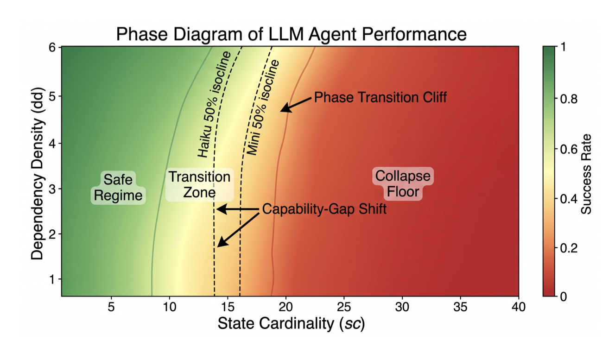

# World-Model Collapse

[](https://arxiv.org/abs/2606.31399)
[](https://arxiv.org/pdf/2606.31399)
[](https://doi.org/10.48550/arXiv.2606.31399)
[](https://www.python.org/)

Research code for **World-Model Collapse as a Phase Transition**.



This repository studies when long-horizon language agents maintain an internal world model and when that model abruptly collapses. It provides deterministic planning environments, LLM-backed and oracle agents, a three-call agent loop, structured JSONL logging, cost tracking, experiment launch scripts, and analysis utilities used to map phase-transition behavior.

## Paper

**World-Model Collapse as a Phase Transition**  
Xinyuan Song, Zekun Cai  
arXiv:2606.31399, submitted June 30, 2026

The paper asks whether long-horizon language agents show a phase transition analogous to water boiling: small increases in state load or horizon can leave behavior nearly unchanged in one regime, but near a critical boundary the same perturbation can trigger a sudden collapse. The experiments sweep state cardinality, dependency density, horizon, branching, observation mode, and mutation rate. Per-step traces show that world-state fidelity fails before action validity, suggesting that agents can act from a corrupted world rather than merely choosing isolated bad actions.

- [arXiv abstract](https://arxiv.org/abs/2606.31399)
- [Paper PDF](https://arxiv.org/pdf/2606.31399)
- [DOI](https://doi.org/10.48550/arXiv.2606.31399)

## What Is in This Repo

The codebase is centered on a controlled agent-evaluation loop:

1. An environment emits an observation and exact gold state.
2. The agent updates its internal world state.
3. The agent plans the next action.
4. The agent self-checks whether the action is valid.
5. The environment executes the action and logs per-step metrics.

The runner records world-state accuracy, action validity, self-check accuracy, false progress, state staleness, token usage, and episode-level success. These logs are then consumed by the analysis scripts for phase-boundary, lag, effect-size, and robustness tests.

## Repository Structure

- `src/environments/`: deterministic task families and the shared environment API.
  - `graph_nav.py`: graph-navigation tasks.
  - `tool_dag.py`: dependency-structured tool-use tasks.
  - `stateful_puzzle.py`: stateful puzzle tasks with rooms, containers, switches, items, subgoals, and dependency-controlled preconditions.
- `src/agents/`: agent interfaces, prompt templates, JSON parsing, oracle agents, and LLM-backed agents.
- `src/evaluation/`: episode execution, world-state metrics, and JSONL logging.
- `src/runner/`: batch runners, cost tracking, cell specifications, and bounded-wave execution.
- `experiments/stage5_smoke/`: small OpenAI smoke test for the full LLM pipeline.
- `experiments/stage5_a/` and `experiments/stage5_b/`: gpt-4o-mini grid experiments.
- `experiments/stage5b_ablations/`: one-axis ablations for horizon, branching, observation noise, and mutation rate.
- `experiments/critical_scans/`: fine-grained sweeps around critical state-cardinality and horizon boundaries.
- `experiments/cross_harness/`: memory-mode and cross-model harness checks, including GPT-4o and Llama-3 variants.
- `analysis/`: acceptance checks, effect sizes, bootstrap confidence intervals, lag analysis, multiple-testing correction, and cluster bootstrap utilities.

## Installation

Use Python 3.10 or newer.

```bash
git clone git@github.com:Hik289/world-model-collapse.git
cd world-model-collapse

python -m venv .venv
source .venv/bin/activate
pip install -r requirements.txt
pip install -e .
```

## Model Configuration

LLM runs are configured through environment variables. Do not commit API keys, local proxy credentials, generated logs, or cost trackers.

OpenAI:

```bash
export OPENAI_API_KEY="your-openai-api-key"
```

Optional Azure OpenAI route for model names prefixed with `azure:`:

```bash
export AZURE_OPENAI_ENDPOINT="https://your-resource.openai.azure.com/openai/v1"
export AZURE_OPENAI_KEY="your-azure-key"
```

Optional Anthropic-compatible local proxy:

```bash
export ANTHROPIC_PROXY_URL="http://127.0.0.1:18801/v1/messages"
```

Optional AWS Bedrock support uses local AWS credentials configured outside this repository.

## Quick Start

After setting `OPENAI_API_KEY`, run the smoke test:

```bash
python experiments/stage5_smoke/run_stage5_smoke.py
```

This runs a small `gpt-4o-mini` slice on `stateful_puzzle`, writes step and episode logs under `data/raw_logs/`, and writes a summary to:

```text
experiments/stage5_smoke/stage5_smoke_results.json
```

Generated artifacts under `data/`, `outputs/`, `results/`, `logs/`, `*.jsonl`, and cost-tracker files are ignored by Git.

## Running Experiment Families

Critical scans:

```bash
python experiments/critical_scans/run_exp_sc_fine.py
python experiments/critical_scans/run_exp_t_fine.py
```

Stage 5B ablations:

```bash
python experiments/stage5b_ablations/run_stage5b_ablation_T.py
python experiments/stage5b_ablations/run_stage5b_ablation_branching.py
python experiments/stage5b_ablations/run_stage5b_ablation_obs_noise.py
python experiments/stage5b_ablations/run_stage5b_ablation_mut_rate.py
```

Cross-harness checks:

```bash
python experiments/cross_harness/run_exp_b_mode_a.py
python experiments/cross_harness/run_exp_C1_llama3.py
python experiments/cross_harness/run_exp_C2_gpt4o.py
```

Several full-grid scripts expect pre-generated seed files such as `stage5_a_task_seeds.json` or `stage5_b_task_seeds.json`. Keep those files, generated logs, and result JSONs out of commits unless intentionally releasing a frozen artifact.

## Analysis Utilities

Examples:

```bash
python analysis/stage4_g1_acceptance.py
python analysis/stage4_g1_acceptance_v2.py
python analysis/effect_sizes.py
python analysis/scstar_bootstrap_cis.py

python analysis/scripts/tier2a_g1b.py
python analysis/scripts/tier2b_g4.py
python analysis/scripts/tier2c_lee_drift.py
python analysis/scripts/tier2d_multiple_testing.py
python analysis/scripts/tier2e_cluster_bootstrap.py
```

Most analysis scripts read from `data/raw_logs/` and write JSON or Markdown summaries under `analysis/`.

## Programmatic Use

```python
from src.environments import ENV_REGISTRY

env_cls = ENV_REGISTRY["stateful_puzzle"]
env = env_cls()

obs = env.reset(
    task_config={
        "archetype": "demo",
        "stress_config": {
            "T": 20,
            "state_card": 5,
            "branching": 2,
            "obs_noise": "clean",
            "mut_rate": "static",
            "dep_density": 2,
        },
    },
    seed=123,
)

print(obs.text)
```

Available environments are registered in `src.environments.ENV_REGISTRY`:

- `graph_nav`
- `tool_dag`
- `stateful_puzzle`

## Reproducibility Notes

The environments are deterministic by design. Randomness flows through seeded per-environment RNG instances, state is canonicalized before hashing, and unordered structures are sorted where possible.

The evaluation runner logs both per-step and per-episode records. Per-step records include the agent world state, gold world state, action validity, world-state accuracy, self-check correctness, false progress, state staleness, and token usage. Episode records summarize success, collapse indicators, mean metrics, and aggregate token/cost fields.

## Citation

If you use this codebase or build on the paper, please cite:

```bibtex
@article{song2026worldmodelcollapse,
  title   = {World-Model Collapse as a Phase Transition},
  author  = {Song, Xinyuan and Cai, Zekun},
  journal = {arXiv preprint arXiv:2606.31399},
  year    = {2026},
  doi     = {10.48550/arXiv.2606.31399},
  url     = {https://arxiv.org/abs/2606.31399}
}
```

## License

Add your preferred license before publishing if this repository will be distributed publicly.
